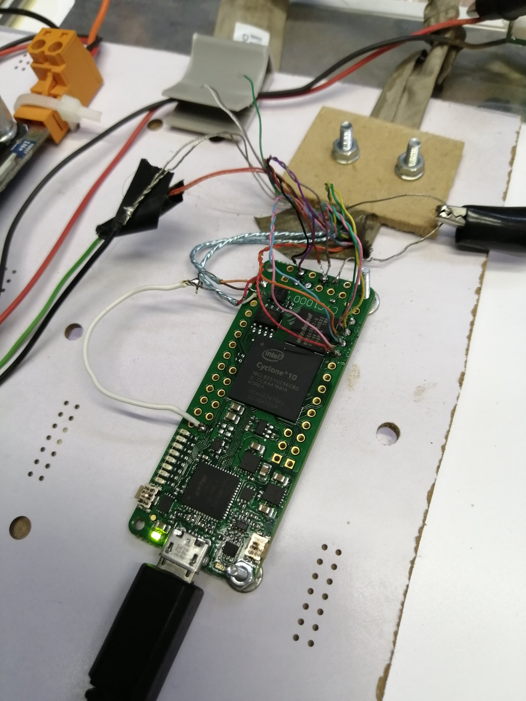
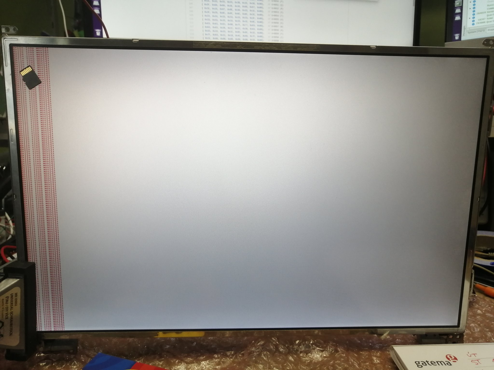
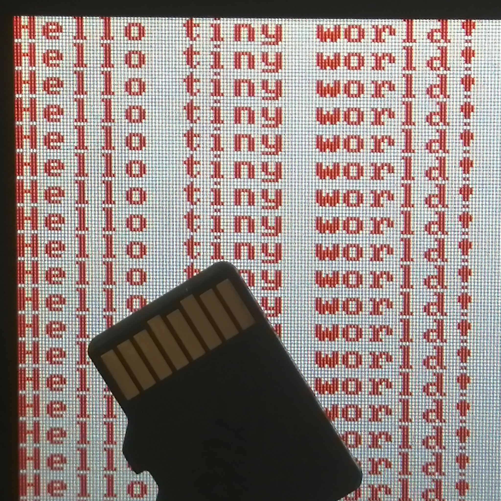
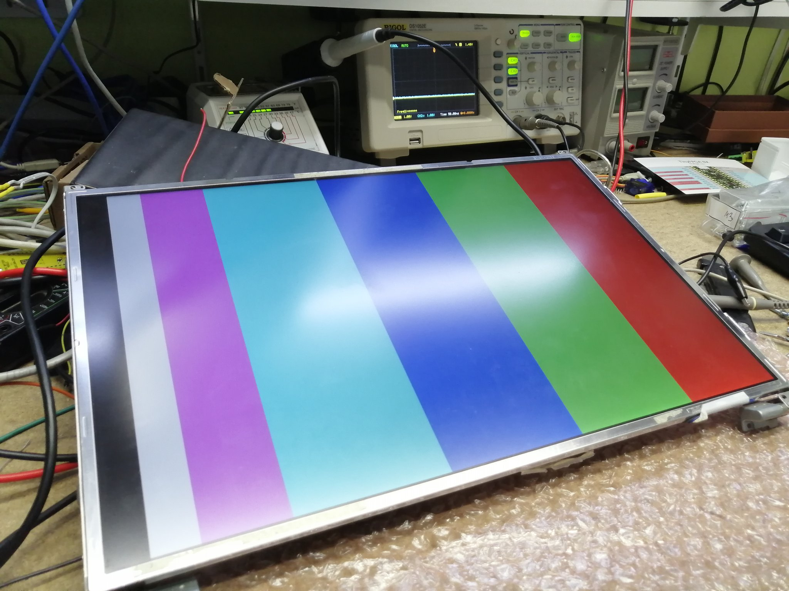

# CYC1000_FPGA_LVDS_DISPLAY
Display ASCII characters on dual-LVDS display with Cyclone 10 LP CYC1000 kit

## Old kit with Lattice MachXO2

I interfaced the same display with older FPGA. I was just curious how the FPGA works and this was my first project. I run into all the troubles including timing constraints.

https://www.youtube.com/watch?v=MXM3ovkfT74

https://www.youtube.com/watch?v=BldAWWNUepo

## CYC1000 Arrow Trenz Kit

I wanted more powerful kit for this display so I could run some soft-core processor and also take an advantage of SDRAM which could act as a bitmap framebuffer.

## Current state

Right now the code can only display text from serial port. SDRAM seems to work but needs finalization. It would need burst transfers to be fast enough to keep the data flowing just in time to send them over LVDS.

